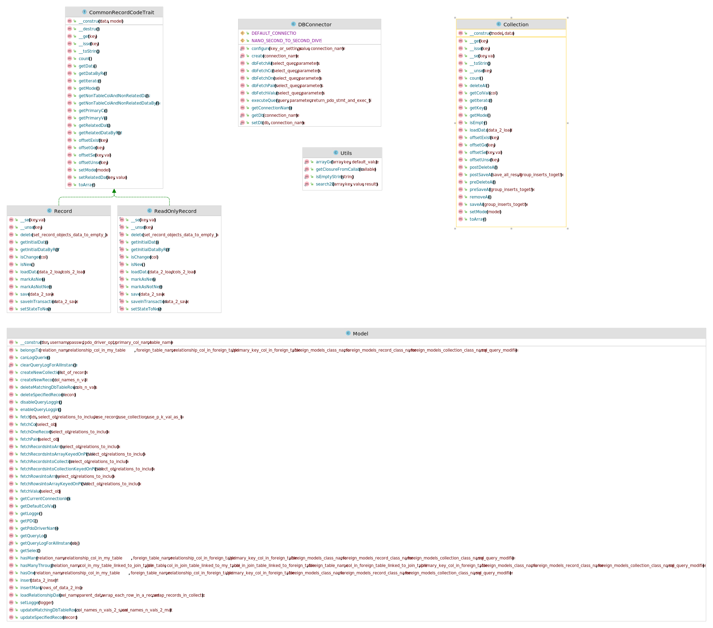

 &nbsp; 
 &nbsp; 
 &nbsp; 
 &nbsp; 
 &nbsp; 
 &nbsp; 
 &nbsp; 
 &nbsp; 
 &nbsp; 
 &nbsp; 
 &nbsp; 

# LeanOrm

#### A [Generic Data Objects](https://github.com/rotexsoft/gdao/blob/master/README.md) implementation. A light-weight, highly performant PHP data access library. 

## Installation Requirements

PHP 7.4+.

[Composer](https://getcomposer.org/)

Version 2.X of this package has been rigorously tested against sqlite 3.7.11+, 
MySQL 8.0.29+ & Postgresql 15.1+. 

MS SQL Server, is theoretically supported but hasn't been tested. 
Will provide more updates on MS SQL Server support once testing 
on that DB engine has been done.

If you are using Sqlite, version sqlite 3.7.11 or higher is required.

Version 1.X of this package never got a stable release. Please use version 2.X+ of this package.

## Installation

    >`composer require rotexsoft/leanorm`

## Running Tests

    >`./vendor/bin/phpunit --coverage-text`

> You can set the environment variable **LEANORM_PDO_DSN** with a valid $dsn string for pdo e.g. LEANORM_PDO_DSN=sqlite::memory:

> You can set the environment variable **LEANORM_PDO_USERNAME** with a valid $username string for pdo if needed e.g. LEANORM_PDO_USERNAME=jblow

> You can set the environment variable **LEANORM_PDO_PASSWORD** with a valid $password string for pdo if needed e.g. LEANORM_PDO_PASSWORD=some_password

> For example:

>   `LEANORM_PDO_DSN=sqlite::memory: LEANORM_PDO_USERNAME=jblow LEANORM_PDO_PASSWORD=some_password ./vendor/bin/phpunit --coverage-text`

>   `LEANORM_PDO_DSN="mysql:host=hostname_or_ip_address;dbname=blog" LEANORM_PDO_USERNAME="jblow" LEANORM_PDO_PASSWORD="some_password" ./vendor/bin/phpunit --coverage-text`

### GDAO Classes & Interfaces

### LeanORM Classes

* **\LeanOrm\Model** extends the abstract **\GDAO\Model** class
* **\LeanOrm\Model\Record** & **\LeanOrm\Model\ReadOnlyRecord** both implement **\GDAO\Model\RecordInterface**
* **\LeanOrm\Model\Collection** implements **\GDAO\Model\CollectionInterface**

## Documentation
Documentation can be found [here](docs/index.md). 
Please submit an issue (preferably with a pull request) to address mistakes 
or ommissions in the documentation or to propose improvements to the documentation. 
