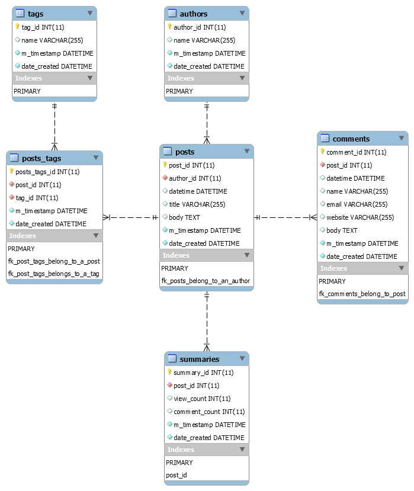

# Comprehensive Guide

- [Design Considerations](#design-considerations)
- [How it works](#how-it-works)
    - [Defining and Creating Model Objects](#defining-and-creating-model-objects)
        - [Using a Factory Function to Instantiate & Retrieve Models](#using-a-factory-function-to-instantiate-and-retrieve-models)
    - [Creating Records & Inserting Data into the Database](#creating-records--inserting-data-into-the-database)
    - [Methods for Fetching data from the Database](#methods-for-fetching-data-from-the-database)
        - [Fetching data from the Database via fetchCol](#fetching-data-from-the-database-via-fetchcol)
        - [Fetching data from the Database via fetchOneRecord](#fetching-data-from-the-database-via-fetchonerecord)
        - [Fetching data from the Database via fetchOneByPkey](#fetching-data-from-the-database-via-fetchonebypkey)
        - [Fetching data from the Database via fetchPairs](#fetching-data-from-the-database-via-fetchpairs)
        - [Fetching data from the Database via fetchRecordsIntoArray](#fetching-data-from-the-database-via-fetchrecordsintoarray)
        - [Fetching data from the Database via fetchRecordsIntoArrayKeyedOnPkVal](#fetching-data-from-the-database-via-fetchrecordsintoarraykeyedonpkval)
        - [Fetching data from the Database via fetchRecordsIntoCollection](#fetching-data-from-the-database-via-fetchrecordsintocollection)
        - [Fetching data from the Database via fetchRecordsIntoCollectionKeyedOnPkVal](#fetching-data-from-the-database-via-fetchrecordsintocollectionkeyedonpkval)
        - [Fetching data from the Database via fetchRowsIntoArray](#fetching-data-from-the-database-via-fetchrowsintoarray)
        - [Fetching data from the Database via fetchRowsIntoArrayKeyedOnPkVal](#fetching-data-from-the-database-via-fetchrowsintoarraykeyedonpkval)
        - [Fetching data from the Database via fetchValue](#fetching-data-from-the-database-via-fetchvalue)
        - [Fetching data from the Database via fetch](#fetching-data-from-the-database-via-fetch)
    - [Deleting Data](#deleting-data)
    - [Updating Data](#updating-data)
    - [Defining Relationships between Models and Working with Related Data](#defining-relationships-between-models-and-working-with-related-data)
        - [Belongs To](#belongs-to)
        - [Has One](#has-one)
        - [Has Many](#has-many)
        - [Has Many Through](#has-many-through-aka-many-to-many)
        - [Relationship Definition Code Samples](#relationship-definition-code-samples)
        - [Accessing Related Data Code Samples](#accessing-related-data-code-samples)
    - [Query Logging](#query-logging)

## Design Considerations

Applications using this package are:

- Expected to have each database table with a single preferably auto-incrementing numeric primary key column (composite primary keys are not supported; however a single primary key column that is non-numeric should still work)

## How it works

LeanOrm will create only one PDO connection to a specific database (ie. one PDO connection per unique dsn string). Creating one or more Model objects for one or more tables with the same dsn string will lead to the creation of only one PDO connection to the database; that one PDO connection will be shared amongst all model instances created with that same dsn string. If you use two different dsn strings, two PDO connections to the database(s) will be created by LeanOrm. Consequently, using three different dsn strings will lead to the creation of three different PDO database connections, and so on for four or more different dsn strings.

All examples are based on the schema below:



Below are the Sql statements for setting up this database in Mysql 8.0+

```sql
/*!40101 SET NAMES utf8 */;

/*!40101 SET SQL_MODE=''*/;

/*!40014 SET @OLD_UNIQUE_CHECKS=@@UNIQUE_CHECKS, UNIQUE_CHECKS=0 */;
/*!40014 SET @OLD_FOREIGN_KEY_CHECKS=@@FOREIGN_KEY_CHECKS, FOREIGN_KEY_CHECKS=0 */;
/*!40101 SET @OLD_SQL_MODE=@@SQL_MODE, SQL_MODE='NO_AUTO_VALUE_ON_ZERO' */;
/*!40111 SET @OLD_SQL_NOTES=@@SQL_NOTES, SQL_NOTES=0 */;
CREATE DATABASE /*!32312 IF NOT EXISTS*/`blog` /*!40100 DEFAULT CHARACTER SET latin1 */ /*!80016 DEFAULT ENCRYPTION='N' */;

USE `blog`;

/*Table structure for table `authors` */

DROP TABLE IF EXISTS `authors`;

CREATE TABLE `authors` (
  `author_id` INT UNSIGNED NOT NULL AUTO_INCREMENT,
  `name` VARCHAR(255) DEFAULT NULL,
  `m_timestamp` DATETIME NOT NULL,
  `date_created` DATETIME NOT NULL,
  PRIMARY KEY (`author_id`)
) ENGINE=INNODB;

/*Table structure for table `comments` */

DROP TABLE IF EXISTS `comments`;

CREATE TABLE `comments` (
  `comment_id` INT UNSIGNED NOT NULL AUTO_INCREMENT,
  `post_id` INT UNSIGNED NOT NULL,
  `datetime` DATETIME DEFAULT NULL,
  `name` VARCHAR(255) DEFAULT NULL,
  `email` VARCHAR(255) DEFAULT NULL,
  `website` VARCHAR(255) DEFAULT NULL,
  `body` TEXT,
  `m_timestamp` DATETIME NOT NULL,
  `date_created` DATETIME NOT NULL,
  PRIMARY KEY (`comment_id`),
  KEY `fk_comments_belong_to_post` (`post_id`),
  CONSTRAINT `fk_comments_belong_to_post` FOREIGN KEY (`post_id`) REFERENCES `posts` (`post_id`) ON DELETE CASCADE ON UPDATE CASCADE
) ENGINE=INNODB;

/*Table structure for table `posts` */

DROP TABLE IF EXISTS `posts`;

CREATE TABLE `posts` (
  `post_id` INT UNSIGNED NOT NULL AUTO_INCREMENT,
  `author_id` INT UNSIGNED NOT NULL,
  `datetime` DATETIME DEFAULT NULL,
  `title` VARCHAR(255) DEFAULT NULL,
  `body` TEXT,
  `m_timestamp` DATETIME NOT NULL,
  `date_created` DATETIME NOT NULL,
  PRIMARY KEY (`post_id`),
  KEY `fk_posts_belong_to_an_author` (`author_id`),
  CONSTRAINT `fk_posts_belong_to_an_author` FOREIGN KEY (`author_id`) REFERENCES `authors` (`author_id`) ON DELETE CASCADE ON UPDATE CASCADE
) ENGINE=INNODB;

/*Table structure for table `posts_tags` */

DROP TABLE IF EXISTS `posts_tags`;

CREATE TABLE `posts_tags` (
  `posts_tags_id` INT UNSIGNED NOT NULL AUTO_INCREMENT,
  `post_id` INT UNSIGNED NOT NULL,
  `tag_id` INT UNSIGNED NOT NULL,
  `m_timestamp` DATETIME NOT NULL,
  `date_created` DATETIME NOT NULL,
  PRIMARY KEY (`posts_tags_id`),
  KEY `fk_post_tags_belong_to_a_post` (`post_id`),
  KEY `fk_post_tags_belongs_to_a_tag` (`tag_id`),
  CONSTRAINT `fk_post_tags_belong_to_a_post` FOREIGN KEY (`post_id`) REFERENCES `posts` (`post_id`) ON DELETE CASCADE ON UPDATE CASCADE,
  CONSTRAINT `fk_post_tags_belongs_to_a_tag` FOREIGN KEY (`tag_id`) REFERENCES `tags` (`tag_id`) ON DELETE CASCADE ON UPDATE CASCADE
) ENGINE=INNODB;

/*Table structure for table `summaries` */

DROP TABLE IF EXISTS `summaries`;

CREATE TABLE `summaries` (
  `summary_id` INT UNSIGNED NOT NULL AUTO_INCREMENT,
  `post_id` INT UNSIGNED NOT NULL,
  `view_count` INT DEFAULT NULL,
  `comment_count` INT DEFAULT NULL,
  `m_timestamp` DATETIME NOT NULL,
  `date_created` DATETIME NOT NULL,
  PRIMARY KEY (`summary_id`),
  UNIQUE KEY `post_id` (`post_id`),
  CONSTRAINT `fk_a_post_has_one_summary` FOREIGN KEY (`post_id`) REFERENCES `posts` (`post_id`) ON DELETE CASCADE ON UPDATE CASCADE
) ENGINE=INNODB;

/*Table structure for table `tags` */

DROP TABLE IF EXISTS `tags`;

CREATE TABLE `tags` (
  `tag_id` INT UNSIGNED NOT NULL AUTO_INCREMENT,
  `name` VARCHAR(255) DEFAULT NULL,
  `m_timestamp` DATETIME NOT NULL,
  `date_created` DATETIME NOT NULL,
  PRIMARY KEY (`tag_id`)
) ENGINE=INNODB;

/*!40101 SET SQL_MODE=@OLD_SQL_MODE */;
/*!40014 SET FOREIGN_KEY_CHECKS=@OLD_FOREIGN_KEY_CHECKS */;
/*!40014 SET UNIQUE_CHECKS=@OLD_UNIQUE_CHECKS */;
/*!40111 SET SQL_NOTES=@OLD_SQL_NOTES */;
```

### Defining and Creating Model Objects

There are two basic ways to use this package:

1. Create instances of **\LeanOrm\Model** (one for each database table in your application's database) and then use each instance to fetch, insert, update & delete the database table data. This approach is good for small to medium sized projects. Such instances use **\LeanOrm\Model\Collection** & **\LeanOrm\Model\Record** by default. Below is an example of creating an instance of **\LeanOrm\Model** associated with an **authors** table in the database:

```php
<?php
$authorsModel = 
    new \LeanOrm\Model(
        "mysql:some-host-name;dbname=blog", // dsn string
        "u", // username
        "p", // password
        [PDO::MYSQL_ATTR_INIT_COMMAND => 'SET NAMES utf8'], //pdo options
        'author_id', // primary key column name
        'authors' // table name
    );

//////////////////////////////////////////
// You can go on to define relationships, 
// change the Record & Collection classes
// used by this instance, etc:
//////////////////////////////////////////

// $authorsModel->belongsTo(...)
// $authorsModel->hasMany(...);
// $authorsModel->hasManyThrough(...);
// $authorsModel->hasOne(...);

// Set collection class to use for this instance. 
// Instances of this collection class will be  
// returned by Model methods that return a collection
// $authorsModel->setCollectionClassName(...);

// Set record class to use for this instance. 
// Instances of this record class will be  
// returned by Model methods that return a record
// $authorsModel->setRecordClassName(...);
```

2. Or you could create Model classes for each database table in your application's database. Each of these classes must extend **\LeanOrm\Model**. This is the recommended approach for large applications. There is a [tool](https://github.com/rotexsoft/leanorm-cli) you can use to automatically generate Model, Record & Collection classes for each of the tables & views in your database. Below are examples of a Model, Collection & Record classes associated with an **authors** table in the database:

**AuthorsModel.php**

```php
<?php
declare(strict_types=1);

class AuthorsModel extends \LeanOrm\Model {
    
    // you can change this during runtime by calling 
    // setCollectionClassName(...) on an instance of this class
    protected ?string $collection_class_name = AuthorsCollection::class;
    
    // you can change this during runtime by calling 
    // setRecordClassName(...) on an instance of this class
    protected ?string $record_class_name = AuthorRecord::class;

    protected ?string $created_timestamp_column_name = 'date_created';
    protected ?string $updated_timestamp_column_name = 'm_timestamp';
    protected string $primary_col = 'author_id';
    protected string $table_name = 'authors';
    
    public function __construct(
        string $dsn = '', 
        string $username = '', 
        string $passwd = '', 
         array $pdo_driver_opts = [], 
        string $primary_col_name = '', 
        string $table_name = ''
    ) {
        parent::__construct(
            $dsn, $username, $passwd, 
            $pdo_driver_opts, $primary_col_name, $table_name
        );
        
        // Define relationships below here
        
        //$this->belongsTo(...)
        //$this->hasMany(...);
        //$this->hasManyThrough(...);
        //$this->hasOne(...)
    }
}

```

**AuthorsCollection.php**

```php
<?php
declare(strict_types=1);

class AuthorsCollection extends \LeanOrm\Model\Collection {
    
    //put your code here
}
```

**AuthorRecord.php**

```php
<?php
declare(strict_types=1);

/**
 * @property mixed $author_id int unsigned NOT NULL
 * @property mixed $name varchar(255)
 * @property mixed $m_timestamp datetime NOT NULL
 * @property mixed $date_created datetime NOT NULL
 */
class AuthorRecord extends \LeanOrm\Model\Record {
    
    //put your code here
}
```

#### Using a Factory Function to Instantiate and Retrieve Models

If you have many tables and views in your database, it may become tedious to have to keep manually adding instances of each Model class needed by your application to a dependencies file or a container. You could simply write a function to create new Models based on the specified class name. 

Below is a simple implementation of a function that creates a single instance of a model per Model class name and always returns that instance when called. You can write something similar to manage the creation of Model objects in your application.

```php
<?php

// This function creates a single instance of a model class for each specified 
// model class and returns that instance every time this function is called.
$createOrGetModel = function(
    string $modelName, 
    string $tableName='', 
    string $primaryColName=''
): \LeanOrm\Model {
    
    static $models;
    
    if(!$models) {
        
        $models = [];
    }
    
    if(array_key_exists($modelName, $models)) {
        
        return $models[$modelName];
    }

    if(!is_a($modelName, \LeanOrm\Model::class, true)) {
        
        throw new \Exception(
            "ERROR: The class name `{$modelName}` supplied for creating a new model is not "
           . "`" . \LeanOrm\Model::class . "` or any of its sub-classes!"
        );
    }
    
    // NOTE: You should use a function like getenv() or similar 
    // to inject the dsn, username and password values into the 
    // constructor call below so you don't commit live credentials
    // into the repository for your project.
    $models[$modelName] = new $modelName(
        'mysql:host=hostname;dbname=blog', 'user', 'passwd',
        [PDO::MYSQL_ATTR_INIT_COMMAND => 'SET NAMES utf8'],
        $primaryColName, $tableName
    );
    
    return $models[$modelName];
};

// You just call the function to create & retrieve an 
// instance of a model class like so:
$authorsModel = $createOrGetModel(AuthorsModel::class);
```


### Creating Records & Inserting Data into the Database

```php
<?php
$authorsModel = new AuthorsModel('mysql:host=hostname;dbname=blog', 'user', 'pwd');

//Method 1:
$newRecord = $authorsModel->createNewRecord(); // create a blank new record
$newRecord->name = 'Joe Blow'; // set a value for a column
$newRecord['name'] = 'Joe Blow'; // also sets a value for a column
$newRecord->save(); // saves the record to the authors table in the database

//Method 2:
$newRecord = $authorsModel->createNewRecord(); // create a blank new record
$newRecord->save([ 'name' => 'Joe Blow']); // you can inject data into the save method

//Method 3:
$newRecord = $authorsModel->createNewRecord([ 'name' => 'Joe Blow']);
$newRecord->save(); // saves the record to the authors table in the database

// NOTE: the save method for Record objects returns 
// - true: successful save, 
// - false: failed save, 
// - null: no changed data to save

//Method 4:
$insertedData = $authorsModel->insert([ 'name' => 'Joe Blow']); // save to the DB
// $insertedData is an associative array of the data just inserted into the
// database. This data will include an auto-generated primary key value, if
// the database table we just inserted the record into has an 
// auto-incrementing primary key column.
$existingRecord = $authorsModel->createNewRecord($insertedData)
                               ->markAsNotNew(); // mark record as not new

// A new record is a record that has never been saved to the database

//Multiple Inserts:
//Below is the most efficient way insert multiple rows to the database.
//$allSuccessfullyInserted will be === true if all the inserts were
//successful, otherwise it will be  === false which means the multiple
//insert was unsuccessful (nothing is saved to the database in this case).
$allSuccessfullyInserted = $authorsModel->insertMany(
                                [
                                    ['name' => 'Joe Blow'],
                                    ['name' => 'Jane Doe']
                                ]
                            );

// For Model classes that have their $created_timestamp_column_name 
// & $updated_timestamp_column_name properties set to valid database
// column names whose data type is a datetime data type, LeanORM will
// automatically populate those fields with the current timestamp
// computed via date('Y-m-d H:i:s') when each new record for that
// Model is inserted into the database.
//
// After successfully inserting a new record into the database via method 1,
// 2 or 3, the record object which save was invoked will be updated with the 
// primary key value of the new record if the record has an 
// auto-incrementing primary key column.
//
// The timestamp values are also added to the record object if those fields
// exist.
//
// When existing records are saved via the save methods on a record object, 
// or via the saveAll method on a collection object or via the update* 
// methods on a Model object, the $updated_timestamp_column_name column in 
// the database automatically gets updated with the current timestamp.

////////////////////////////////////////////////////////////////////////////////
//NOTE: if you have a collection (an instance of \LeanOrm\Model\Collection) 
//      containing 2 or more new (not existing) records you can also efficiently 
//      save the new records by calling \LeanOrm\Model\Collection::saveAll(true). 
//      See the documentation for Collections for more details.
////////////////////////////////////////////////////////////////////////////////
```

### Methods for Fetching data from the Database

> **WARNING:** When fetching data & trying to eager load related data, make sure the column on which the relationship is defined is amongst the columns you have specified to be selected in the fetch query (if you have chosen to explicitly specify columns to be returned by the fetch* method) because values from that column would be needed to fetch related data. If you don't specify any columns, then all columns (including the column on which the relationship is defined) in the table/view are returned.

The following methods for fetching data from the database are defined in **\GDAO\Model** which is extended by **\LeanOrm\Model**:

- [__**fetchCol(?object $query = null): array**__](#fetching-data-from-the-database-via-fetchcol)
> selects data from a single database table's / view's column and returns an array of the column values. By default, it selects data from the first column in a database table / view.

- [__**fetchOneRecord(?object $query = null, array $relations_to_include = []): ?\GDAO\Model\RecordInterface**__](#fetching-data-from-the-database-via-fetchonerecord)
> selects a single row of data from a database table / view and returns it as an instance of **\LeanOrm\Model\Record** (or any of its subclasses). By default, it fetches the first row of data in a database table / view into a Record object. This method returns null if the table or view is empty or the query doesn't match any record.

- [__**fetchOneByPkey($id, array $relations_to_include = []): ?\GDAO\Model\RecordInterface**__](#fetching-data-from-the-database-via-fetchonebypkey)
> selects a single row of data from a database table / view whose primary key value matches the specified primary key value in the **$id** parameter. For views, the primary key field will be whatever value is set in the Model class' **primary_col** property. This method returns an instance of **\LeanOrm\Model\Record** (or any of its subclasses). This method returns null if the table or view is empty or the specified primary key value doesn't match any record in the database table / view.

- [__**fetchPairs(?object $query = null): array**__](#fetching-data-from-the-database-via-fetchpairs)
> selects data from two database table / view columns and returns an array whose keys are values from the first column and whose values are the values from the second column. By default, it selects data from the first two columns in a database table / view.

- [__**fetchRecordsIntoArray(?object $query = null, array $relations_to_include = []): array**__](#fetching-data-from-the-database-via-fetchrecordsintoarray)
> selects one or more rows of data from a database table / view and returns them as instances of **\LeanOrm\Model\Record** (or any of its subclasses) inside an array. By default, it selects all rows of data in a database table / view and returns them as an array of record objects.

- [__**fetchRecordsIntoCollection(?object $query = null, array $relations_to_include = []): \GDAO\Model\CollectionInterface**__](#fetching-data-from-the-database-via-fetchrecordsintocollection)
> selects one or more rows of data from a database table / view and returns them as instances of **\LeanOrm\Model\Record** (or any of its subclasses) inside an instance of **\LeanOrm\Model\Collection** (or any of its subclasses). By default, it selects all rows of data in a database table / view and returns them as a collection of record objects.

- [__**function fetchRowsIntoArray(?object $query = null, array $relations_to_include = []): array**__](#fetching-data-from-the-database-via-fetchrowsintoarray)
> selects one or more rows of data from a database table / view and returns them as associative arrays inside an array. By default, it selects all rows of data in a database table / view and returns them as associative arrays inside an array.

- [__**fetchValue(?object $query = null): mixed**__](#fetching-data-from-the-database-via-fetchvalue)
> selects a single value from a single column of a single row of data from a database table / view and returns the value (eg. as a string, or an appropriate data type). By default, it selects the value of the first column of the first row of data from a database table / view.

All these fetch methods accept a first argument which is a query object. LeanOrm uses [Aura\SqlQuery](https://github.com/auraphp/Aura.SqlQuery/blob/3.x/docs/select.md) as its query object. You can create a query object to inject into each fetch method using the **getSelect(): \Aura\SqlQuery\Common\Select** method in **\LeanOrm\Model**. Read the documentation for [Aura\SqlQuery](https://github.com/auraphp/Aura.SqlQuery/blob/3.x/docs/select.md) to figure out how to customize the sql queries executed by each fetch method. Some examples will be shown later on below.

> NOTE: Please ALWAYS use named parameters / place-holders in all your queries, [Aura\SqlQuery](https://github.com/auraphp/Aura.SqlQuery/blob/3.x/docs/select.md) version 3.x was designed to work with named parameters / place-holders. DO NOT use question mark parameters / place-holders in your queries.

Some of these fetch methods also accept a second argument called **$relations_to_include**. It is basically an array of relationship names for related data defined in the Model class. When you specify these relationship names in a fetch method, the fetch method will eager load the related data which would eliminate the need to issues N queries to fetch the related data for a specified defined relation for each fetched record which leads to the N+1 problem. For example, when fetching records from the authors table via the AuthorsModel, each author record / row can have one or more posts associated with it. If you do not specify that the posts for the author records be eager fetched during a fetch, then when you loop through the returned author records, additional queries will be issued to fetch the posts for each author. If we have 3 authors in the database, then doing a fetch without eager loading posts will lead to the following queries being issued when you loop through the authors and try to access the posts associated with each of them:

```sql
select * from authors
select * from posts where author_id = 1
select * from posts where author_id = 2
select * from posts where author_id = 3
```

If we eager load the posts during the call to the fetch method, then only the two queries below will be issued regardless of how many author records exist in the authors table. 

```sql
select * from authors
select * from posts where author_id IN ( ids of all the authors we are fetching)
```

The second query above is pseudo-code. It is used to grab all the posts needed and the fetch method will stitch the associated posts to the matching author records. This is the better and efficient way to load related data.

The following methods for fetching data from the database are NOT defined in **\GDAO\Model** but are only defined in **\LeanOrm\Model** (other Model classes directly extending **\GDAO\Model** may not implement them):

```php
public function fetch(
    array $ids, 
    ?\Aura\SqlQuery\Common\Select $select_obj=null, 
    array $relations_to_include=[], 
    bool $use_records=false, 
    bool $use_collections=false, 
    bool $use_p_k_val_as_key=false
): array|\LeanOrm\Model\Collection
```
> Selects one or more rows of data from a database table / view whose primary key values in the database table / view matches the primary key values specified in the **$ids** and returns them as instances of **\LeanOrm\Model\Record** (or any of its subclasses) inside an array or an instance of **\LeanOrm\Model\Collection** (or any of its subclasses) or returns them as an array of arrays.


```php
public function fetchRecordsIntoArrayKeyedOnPkVal(
    ?\Aura\SqlQuery\Common\Select $select_obj=null, 
    array $relations_to_include=[]
): array
```
> Works exactly like **fetchRecordsIntoArray**, except that each record in the returned array has a key whose value is the value of the record's primary key field, as opposed to the sequential 0 to N-1 keys which are present in the array returned by **fetchRecordsIntoArray**

```php
public function fetchRecordsIntoCollectionKeyedOnPkVal(
    ?\Aura\SqlQuery\Common\Select $select_obj=null, 
    array $relations_to_include=[]
): \GDAO\Model\CollectionInterface
```
> Works exactly like **fetchRecordsIntoCollection**, except that each record in the returned collection has a key whose value is the value of the record's primary key field, as opposed to the sequential 0 to N-1 keys which are present in the collection returned by **fetchRecordsIntoCollection**

```php
public function fetchRowsIntoArrayKeyedOnPkVal(
    ?\Aura\SqlQuery\Common\Select $select_obj=null, 
    array $relations_to_include=[]
): array
```
> Works exactly like **fetchRowsIntoArray**, except that each row in the returned array has a key whose value is the value of the row's primary key field, as opposed to the sequential 0 to N-1 keys which are present in the array returned by **fetchRowsIntoArray**

#### Fetching data from the Database via fetchCol

If you want to grab all the values for a specific database column in a database table, use the fetchCol method. Below are a few examples of how to use this method:

```php
<?php
$authorsModel = new AuthorsModel('mysql:host=hostname;dbname=blog', 'user', 'pwd');


// $colVals will contain all the values in the first column (i.e. author_id)
// of the authors table
$colVals = $authorsModel->fetchCol();

// $colVals will contain all the values in the specified column (i.e. name)
// of the authors table where the author_id <= 5
$colVals = $authorsModel->fetchCol(
                $authorsModel->getSelect()
                             ->cols(['name'])
                             ->where(' author_id <= :author_id_val ', ['author_id_val' => 5])
            );
```

#### Fetching data from the Database via fetchOneRecord

If you want to fetch just one row of data from a database table into a record object, use the fetchOneRecord method. This method returns null if the table or view is empty or the query doesn't match any record. Below are a few examples of how to use this method:

```php
<?php
$authorsModel = new AuthorsModel('mysql:host=hostname;dbname=blog', 'user', 'pwd');

// $record will contain the first row of data returned by
// select authors.* from authors Limit 1;
$record = $authorsModel->fetchOneRecord();

// $record will contain the first row of data returned by
// select authors.author_id, authors.name from authors where author_id = 5;
$record = $authorsModel->fetchOneRecord(
            $authorsModel->getSelect()
                         ->cols(['author_id', 'name'])
                         ->where(' author_id = :author_id_val ', ['author_id_val' => 5])
        );

// $record will contain the first row of data returned by
//   select authors.author_id, authors.name from authors where author_id = 5;
//      
// It will also contain a collection of posts records returned by
//   select posts.* from posts where author_id = 5;
$record = $authorsModel->fetchOneRecord(
            $authorsModel->getSelect()
                         ->cols(['author_id', 'name'])
                         ->where(' author_id = :author_id_val ', ['author_id_val' => 5]),
            ['posts'] // eager fetch posts for the author
        );
```

#### Fetching data from the Database via fetchOneByPkey

If you want to fetch just one row of data from a database table into a record object and you know the primary key value of the row of data you want to fetch, use the fetchOneByPkey method. This method returns null if the table or view is empty or the specified primary key value doesn't match any record. Below are a few examples of how to use this method:

```php
<?php
$authorsModel = new AuthorsModel('mysql:host=hostname;dbname=blog', 'user', 'pwd');

// $record will contain the first row of data returned by
// select authors.* from authors where author_id = 5;
$record = $authorsModel->fetchOneByPkey(5);

// $record will contain the first row of data returned by
//   select authors.* from authors where author_id = 5;
//      
// It will also contain a collection of posts records returned by
//   select posts.* from posts where author_id = 5;
$record = $authorsModel->fetchOneByPkey(
            5,
            ['posts'] // eager fetch posts for the author
        );
```

#### Fetching data from the Database via fetchPairs

If you want to fetch key value pairs from two columns in a database table, use the fetchPairs method. A good example of when to use this method is when you want to generate a drop-down list of authors in your application where the author_id will be the value of each select option item and the author's name will be the display text for each select option item. Below are a few examples of how to use this method:

```php
<?php
$authorsModel = new AuthorsModel('mysql:host=hostname;dbname=blog', 'user', 'pwd');

// $keyValPairs will be an array whose keys have values from the first column (i.e. author_id)
// of the authors table and whose corresponding values have values from the second column (i.e. name)
// of the authors table.
$keyValPairs = $authorsModel->fetchPairs();

// $keyValPairs will be an array whose keys have values from the first specified column (i.e. author_id)
// of the authors table and whose corresponding values have values from the second specified column 
// (i.e. date_created) of the authors table where the author_id <= 5
$keyValPairs = $authorsModel->fetchPairs(
                $authorsModel->getSelect()
                             ->cols(['author_id', 'date_created'])
                             ->where(' author_id <= :author_id_val ', ['author_id_val' => 5])
            );

// Similar to example above, except that the second specified column is an expression
// (i.e. `concat(author_id, '-', 'name')` ). When using expressions in your fetch 
// method calls, try to use expressions supported by mysql, postgres, sqlite &
// sqlsrvr so that when you change your dsn to use any of the database engines
// your code will still work, if not, you would have to manually update your code
// to make it work when you change your dsn to a different database engine.
$keyValPairs = $authorsModel->fetchPairs(
                $authorsModel->getSelect()
                             ->cols(['author_id', " concat(author_id, '-', 'name') "])
                             ->where(' author_id <= :author_id_val ', ['author_id_val' => 5])
            );
```

#### Fetching data from the Database via fetchRecordsIntoArray

If you want to fetch rows of data from a database table as record objects stored in an array whose keys start from 0 and end at N-1, then use the fetchRecordsIntoArray method. 

This method is slightly more memory efficient than fetchRecordsIntoCollection because the returned records & the related data (if any) are not injected into collection objects. You however lose the ability to call collection class methods on the returned result, but would have to individually call the record class methods on each record in the returned array to do things like save or delete each record after modification. Below are a few examples of how to use this method:

```php
<?php
$authorsModel = new AuthorsModel('mysql:host=hostname;dbname=blog', 'user', 'pwd');

// $records is an array containing the all rows of data as record objects returned by
// select authors.* from authors;
$records = $authorsModel->fetchRecordsIntoArray();

// $records is an array containing the all rows of data as record objects returned by
// select authors.author_id, authors.name from authors where author_id <= 5;
$records = $authorsModel->fetchRecordsIntoArray(
            $authorsModel->getSelect()
                         ->cols(['author_id', 'name'])
                         ->where(' author_id <= :author_id_val ', ['author_id_val' => 5])
        );

// $records is an array containing the all rows of data as record objects returned by
//   select authors.author_id, authors.name from authors where author_id <= 5;
//      
// Each record will also contain an array of associated posts records returned by
//   select posts.* from posts where author_id in 
//      (select authors.author_id from authors where author_id <= 5);
$records = $authorsModel->fetchRecordsIntoArray(
            $authorsModel->getSelect()
                         ->cols(['author_id', 'name'])
                         ->where(' author_id <= :author_id_val ', ['author_id_val' => 5]),
            ['posts'] // eager fetch posts for all the matching authors
        );
```

#### Fetching data from the Database via fetchRecordsIntoArrayKeyedOnPkVal

If you want to fetch rows of data from a database table as record objects stored in an array whose keys are the primary key values of the matching rows of data in the database table, then use the fetchRecordsIntoArrayKeyedOnPkVal method.

This method works exactly like [fetchRecordsIntoArray](#fetching-data-from-the-database-via-fetchrecordsintoarray), except that the key values in the returned array of records are different.

> **NOTE:** This method is implemented in **\LeanOrm\Model** & not a part of **\GDAO\Model**. Sub-classes of **\GDAO\Model** that are not also sub-classes of **\LeanOrm\Model** are not guaranteed to implement it.

#### Fetching data from the Database via fetchRecordsIntoCollection

If you want to fetch rows of data from a database table as record objects stored in a collection whose keys start from 0 and end at N-1, then use the fetchRecordsIntoCollection method. 

This method uses slightly more memory than other fetch methods that return multiple rows of data because every row of data (including related data) in the result returned by this method is stored in a record object and the record objects are stored in applicable collection objects. Using this method, however, allows you to be able call collection class methods on the collection returned by this method to do things like save all the records in the collection after performing some operations on the the records or delete all the records from the database if they are no longer needed, and so on, this also applies to the related data stored in collection objects for each record. Below are a few examples of how to use this method:

```php
<?php
$authorsModel = new AuthorsModel('mysql:host=hostname;dbname=blog', 'user', 'pwd');

// $records is a collection object containing the all rows of data as record objects returned by
// select authors.* from authors;
$records = $authorsModel->fetchRecordsIntoCollection();

// $records is a collection object containing the all rows of data as record objects returned by
// select authors.author_id, authors.name from authors where author_id <= 5;
$records = $authorsModel->fetchRecordsIntoCollection(
            $authorsModel->getSelect()
                         ->cols(['author_id', 'name'])
                         ->where(' author_id <= :author_id_val ', ['author_id_val' => 5])
        );

// $records is a collection object containing the all rows of data as record objects returned by
//   select authors.author_id, authors.name from authors where author_id <= 5;
//      
// Each record will also contain a collection object of associated posts records returned by
//   select posts.* from posts where author_id in 
//      (select authors.author_id from authors where author_id <= 5);
$records = $authorsModel->fetchRecordsIntoCollection(
            $authorsModel->getSelect()
                         ->cols(['author_id', 'name'])
                         ->where(' author_id <= :author_id_val ', ['author_id_val' => 5]),
            ['posts'] // eager fetch posts for all the matching authors
        );
```

#### Fetching data from the Database via fetchRecordsIntoCollectionKeyedOnPkVal

If you want to fetch rows of data from a database table as record objects stored in a collection object whose keys are the primary key values of the matching rows of data in the database table, then use the fetchRecordsIntoCollectionKeyedOnPkVal method. 

Using this method allows you to be able call collection class methods on the collection returned by this method to do things like save all the records in the collection after performing some operations on the the records or delete all the records from the database if they are no longer needed, and so on.

This method works exactly like [fetchRecordsIntoCollection](#fetching-data-from-the-database-via-fetchrecordsintocollection), except that the key values in the returned collection of records are different.

> **NOTE:** This method is implemented in **\LeanOrm\Model** & not a part of **\GDAO\Model**. Sub-classes of **\GDAO\Model** that are not also sub-classes of **\LeanOrm\Model** are not guaranteed to implement it.

#### Fetching data from the Database via fetchRowsIntoArray

If you want to fetch rows of data from a database table as associative arrays stored in an array whose keys start from 0 and end at N-1, then use the fetchRowsIntoArray method. 

This method is the most memory efficient method to fetch multiple rows of data from a database table because all the data are returned as native php arrays as opposed to other fetch methods that return each row of data as record objects and puts all those records into a collection or an array. Use this method if you just want to display the fetched data & don't need to update & save or delete the fetched data after processing. Below are a few examples of how to use this method:

```php
<?php
$authorsModel = new AuthorsModel('mysql:host=hostname;dbname=blog', 'user', 'pwd');

// $records is an array containing the all rows of data as associative arrays returned by
// select authors.* from authors;
$records = $authorsModel->fetchRowsIntoArray();

// $records is an array containing the all rows of data as associative arrays returned by
// select authors.author_id, authors.name from authors where author_id <= 5;
$records = $authorsModel->fetchRowsIntoArray(
            $authorsModel->getSelect()
                         ->cols(['author_id', 'name'])
                         ->where(' author_id <= :author_id_val ', ['author_id_val' => 5])
        );

// $records is an array containing the all rows of data as record objects returned by
//   select authors.author_id, authors.name from authors where author_id <= 5;
//      
// Each record will also contain an array of associated posts records returned by
//   select posts.* from posts where author_id in 
//      (select authors.author_id from authors where author_id <= 5);
$records = $authorsModel->fetchRowsIntoArray(
            $authorsModel->getSelect()
                         ->cols(['author_id', 'name'])
                         ->where(' author_id <= :author_id_val ', ['author_id_val' => 5]),
            ['posts'] // eager fetch posts for all the matching authors
        );
```

#### Fetching data from the Database via fetchRowsIntoArrayKeyedOnPkVal

If you want to fetch rows of data from a database table as associative arrays stored in an array whose keys are the primary key values of the matching rows of data in the database table, then use the fetchRowsIntoArrayKeyedOnPkVal method. 

This method works exactly like [fetchRowsIntoArray](#fetching-data-from-the-database-via-fetchrowsintoarray), except that the key values in the returned array of associative arrays are different.

> **NOTE:** This method is implemented in **\LeanOrm\Model** & not a part of **\GDAO\Model**. Sub-classes of **\GDAO\Model** that are not also sub-classes of **\LeanOrm\Model** are not guaranteed to implement it.

#### Fetching data from the Database via fetchValue

If you want to fetch a single value from a single column of a single row of data from a database table or a computed value from a database table, then use the fetchValue method. Below are a few examples of how to use this method:

```php
<?php
$authorsModel = new AuthorsModel('mysql:host=hostname;dbname=blog', 'user', 'pwd');

// $value is the value in the first column (i.e. author_id) and first row returned by
// select authors.* from authors;
$value = $authorsModel->fetchValue();

// $value is the value in the first column (i.e. name) and first row returned by
// select authors.name from authors;
$value = $authorsModel->fetchValue(
            $authorsModel->getSelect()
                         ->cols(['name'])
        );

// $value is the computed value returned by
// select max(author_id) from authors;
$value = $authorsModel->fetchValue(
            $authorsModel->getSelect()
                         ->cols([' max(author_id) '])
        );

// $value is the computed value returned by
// select max(author_id) from authors where author_id <= 5;
// Obviously, this value will always be <= 5
$value = $authorsModel->fetchValue(
            $authorsModel->getSelect()
                         ->cols(['max(author_id)'])
                         ->where(' author_id <= :author_id_val ', ['author_id_val' => 5])
        );

// NOTE: if the database table is empty or the select query returns no row(s) of 
//       data, then fetchValue will return NULL
```

#### Fetching data from the Database via fetch

The fetch method is a convenience method that you can use when you know the primary key values of the records you want to fetch from a database table. You just supply the primary key values (in an array) of the records you want to fetch, as its first argument. You can also inject a query object to further customize the query that's used to fetch the desired data under the hood. It calls one of the following methods below depending on the other arguments supplied to it when it's called:
- [**fetchRecordsIntoCollection**](#fetching-data-from-the-database-via-fetchrecordsintocollection)
- [**fetchRecordsIntoCollectionKeyedOnPkVal**](#fetching-data-from-the-database-via-fetchrecordsintocollectionkeyedonpkval)
- [**fetchRecordsIntoArray**](#fetching-data-from-the-database-via-fetchrecordsintoarray)
- [**fetchRecordsIntoArrayKeyedOnPkVal**](#fetching-data-from-the-database-via-fetchrecordsintoarraykeyedonpkval)
- [**fetchRowsIntoArray**](#fetching-data-from-the-database-via-fetchrowsintoarray)
- [**fetchRowsIntoArrayKeyedOnPkVal**](#fetching-data-from-the-database-via-fetchrowsintoarraykeyedonpkval)

See source code documentation for **\LeanOrm\Model::fetch** to understand how to use this method. The query object that you can inject as a second argument to this method works exactly like all the query objects in the prior code samples above.

> **NOTE:** This method is implemented in **\LeanOrm\Model** & not a part of **\GDAO\Model**. Sub-classes of **\GDAO\Model** that are not also sub-classes of **\LeanOrm\Model** are not guaranteed to implement it.


### Deleting Data

There are four ways of deleting data from the database:

1. By fetching one or more existing records from the database into record objects and then calling the **delete** method on each Record object (NOTE: the data is deleted from the database but the Record object still contains the data and is automatically marked as new. To make sure the data is both deleted from the database and cleared out of the Record object the **delete** method on the Record object must be called with a boolean value of **true** as its first parameter). 

2. By fetching one or more existing records from the database into record objects stored in a Collection object, and then calling the **deleteAll** method on the Collection object. This will cause all the records in the collection to be deleted from the database, but the Record objects will still be in the Collection object with their data intact. **removeAll** should additionally be called on the Collection object to remove the Record objects from the Collection object.

3. By calling the **deleteMatchingDbTableRows** method on a Model object. This method does not involve the retrieval of Record objects, rather only the conditions for matching the rows of data in the database table to be deleted needs to be supplied to **deleteMatchingDbTableRows**. It accepts an associative array whose keys should be the names of the database table column names & whose values are the values to use in an equality test to match against the corresponding database column names. If you need more fine grained criteria other than an equality test to match records that need to be deleted, you should consider the fourth option below.

    >Note: there is also a **deleteSpecifiedRecord** method in the Model class which accepts a Record object as parameter and deletes the database row associated with the Record object, sets the primary key value of the Record object to null if the primary key field is auto-incrementing and also sets the **is_new** property of the Record object to the boolean value of true (NOTE: it does not clear all the other data in the Record object). The **deleteSpecifiedRecord** method does not really need to be called, since the delete method in the Record class calls it internally when **delete** is called on a Record object that needs to be deleted.

4. By using the **PDO** object returned by the **getPDO** method of the Model class to execute a delete SQL query directly on the database. You need to be very careful to make sure your deletion query targets the exact records you want to delete so that you don't accidentally delete data that should not be deleted.

> **NOTE:** You can use the Record class' **delete** method & the Collection class' **deleteAll** & **removeAll** methods to also delete fetched related data. 

Below are some code samples demonstrating how to delete data:

```php
<?php
$authorsModel = new AuthorsModel('mysql:host=hostname;dbname=blog', 'user', 'pwd');

// first insert 6 records into the authors table
 $authorsModel->insertMany(
    [
        ['name' => 'Joe Blow'],
        ['name' => 'Jill Blow'],
        ['name' => 'Jack Doe'],
        ['name' => 'Jane Doe'],
        ['name' => 'Jack Bauer'],
        ['name' => 'Jane Bauer'],
    ]
);
 
///////////////////////////////////////////////////////////////////
$joeBlowRecord = $authorsModel->fetchOneRecord(
                    $authorsModel->getSelect()
                                 ->where(' name = :name_val ', [ 'name_val' => 'Joe Blow'])
                );
// - Deletes record from the database table 
// - Flags the record object as new
// - Clears related data associated with the record object 
//      - (does not delete them from the database)
// - Removes the primary key field from the record object, 
//      - if it's an auto-incrementing field in the database table
// - Other remaining data in the record remains 
$joeBlowRecord->delete(false);

///////////////////////////////////////////////////////////////////
$jillBlowRecord = $authorsModel->fetchOneRecord(
                    $authorsModel->getSelect()
                                 ->where(' name = :name_val ', [ 'name_val' => 'Jill Blow'])
                );
// - Deletes record from the database table 
// - Flags the record object as new
// - Clears all data associated with the record object
$jillBlowRecord->delete(true);

///////////////////////////////////////////////////////////////////
$jackAndJaneDoe = $authorsModel->fetchRecordsIntoCollection(
                    $authorsModel->getSelect()
                                 ->where(
                                        ' name IN (:bar) ', // named paceholder for WHERE IN
                                        [ 'bar' => [ 'Jack Doe', 'Jane Doe' ]]
                                    )
                );

// - Delete records from the database 
// - Flags each record object as new
// - Clears related data associated with each record object 
//      - (does not delete them from the database)
// - Removes the primary key field from each record object, 
//      - if it's an auto-incrementing field in the database table
// - Other remaining data in each record remains 
// - Record objects remain in the collection
$jackAndJaneDoe->deleteAll();

// Removes all the record objects from the collection object
// If those record objects are not referenced via any other variable,
// they will be garbage collected when next PHP's garbage collection
// mechanism kicks in.
$jackAndJaneDoe->removeAll();

///////////////////////////////////////////////////////////////////

// Generates and executes the sql query below:
//  DELETE from authors where name in ('Jack Bauer', 'Jane Bauer');
$authorsModel->deleteMatchingDbTableRows(
                [
                    'name' => ['Jack Bauer', 'Jane Bauer']
                ]
            );

///////////////////////////////////////////////////////////////////

// For more complicated DELETE queries, use the PDO object
$pdo = $authorsModel->getPDO();
$data = ['start'=> '2022-12-31 21:10:20', 'end' => '2022-12-31 21:08:20'];
$sql = "DELETE FROM authors WHERE date_created < :start AND m_timestamp < :end";
$pdo->prepare($sql)->execute($data);
```
### Updating Data

These are the ways of updating data in the database:

1. By fetching one or more existing records, modifying them & calling either the **save** or **saveInTransaction** method on each record.

2. By fetching one or more records into a Collection object, modifying those record objects contained in the collection & then calling the **saveAll** method on the collection object.

3. By fetching one or more records & calling the Model class' **updateSpecifiedRecord** method on each record. The Record class' **save** methods actually use **updateSpecifiedRecord** under the hood to save existing records, so you really should not need to be using the Model class' **updateSpecifiedRecord** method to update existing records.

4. By calling the Model class' **updateMatchingDbTableRows** method on any instance of the Model class. This method does not retrieve existing records from the database, it only generates & executes a SQL UPDATE statement with some equality criteria (e.g. WHERE colname = someval or colname in (val1,...,valN) or colname IS NULL) based on the arguments supplied to the method.

5. By using the **PDO** object returned by the **getPDO** method of the Model class to execute an **UPDATE** SQL query directly on the database. You need to be very careful to make sure your **UPDATE** query targets the exact records you want to update so that you don't accidentally update data that should not be updated.

Below are some code samples demonstrating how to update data:

```php
<?php
$authorsModel = new AuthorsModel('mysql:host=hostname;dbname=blog', 'user', 'pwd');


// first insert 6 records into the authors table
 $authorsModel->insertMany(
    [
        ['name' => 'Joe Blow'],
        ['name' => 'Jill Blow'],
        ['name' => 'Jack Doe'],
        ['name' => 'Jane Doe'],
        ['name' => 'Jack Bauer'],
        ['name' => 'Jane Bauer'],
    ]
);
 
///////////////////////////////////////////////////////////////////
$joeBlowRecord = $authorsModel->fetchOneRecord(
                    $authorsModel->getSelect()
                                 ->where(' name = :name_val ', ['name_val' => 'Joe Blow'])
                );

// Prepend a title to Joe Blow's name
$joeBlowRecord->name = 'Mr. ' . $joeBlowRecord->name;
$joeBlowRecord->save(); // update the record

///////////////////////////////////////////////////////////////////
$jackAndJaneDoe = $authorsModel->fetchRecordsIntoCollection(
                    $authorsModel->getSelect()
                                 ->where(
                                        ' name IN (:bar) ', 
                                        [ 'bar' => ['Jack Doe', 'Jane Doe'] ]
                                    )
                );

foreach ($jackAndJaneDoe as $record){

    // reverse the name of each record
    $record->name = strrev($record->name); 
}

// update all the modified records in the collection
$jackAndJaneDoe->saveAll();

///////////////////////////////////////////////////////////////////
$jillBlowRecord = $authorsModel->fetchOneRecord(
                    $authorsModel->getSelect()
                                 ->where(' name = :name_val ', ['name_val' => 'Jill Blow'])
                );

// reverse the name for this record
$jillBlowRecord->name = strrev($jillBlowRecord->name);

// update the record
$authorsModel->updateSpecifiedRecord($jillBlowRecord);

///////////////////////////////////////////////////////////////////

// Generates and executes the sql query below:
//  UPDATE authors set date_created = '20 minutes before now' where name in ('Jack Bauer', 'Jane Bauer');
$authorsModel->updateMatchingDbTableRows(
                [ 
                    'date_created' => date('Y-m-d H:i:s', strtotime("-20 minutes")) 
                ],
                [
                    'name' => ['Jack Bauer', 'Jane Bauer']
                ]
            );

///////////////////////////////////////////////////////////////////

// For more complicated UPDATE queries, use the PDO object
$pdo = $authorsModel->getPDO();
$data = ['start'=> '2022-12-31 21:10:20', 'end' => '2022-12-31 21:08:20'];
$sql = "UPDATE authors SET name = CONCAT(author_id, '-', name) WHERE date_created < :start AND m_timestamp < :end";
$pdo->prepare($sql)->execute($data);
```

### Defining Relationships between Models and Working with Related Data

LeanOrm allows you to define relationships between Model classes. These relationships usually mirror the foreign key relationships between the underlying database tables associated with the models. You can also define relationships between Model classes that represent database views, even though views don't have foreign key definitions at the database levels.

> Just as LeanOrm does not work with tables with composite primary keys, it likewise does not support composite keys for defining relationship between tables, the relationships are defined on a single column in each table.

The schema below will be used in the examples to demonstrate how to define relationships.


Four types of relationships are supported:

#### Belongs-To
Each row of data in a database table / view belongs to only one row of data in another database table / view. For example, if you have two tables, authors and posts, an author record would belong to a post if there is a post_id field in the authors table. If the authors table doesn't have a post_id field (which is the case in the schema diagram above) and instead the posts table has an author_id field (which is also the case in the schema diagram above), then a post record would belong to an author. Where the foreign key column is located is what determines which entity belongs to the other.


#### Has-One 
Each row of data in a database table / view has zero or only one row of data in another database table / view. For example, if you have two tables, posts and summaries, a summary record has one post if there is a summary_id field in the posts table. If the posts table doesn't have a summary_id field (which is the case in the schema diagram above) and instead the summaries table has a post_id field (which is also the case in the schema diagram above), this means that a post record has zero or one summary. Where the foreign key column is located is what determines which entity owns the other. This type of relationship is also a variant of **Has-Many**, in which the many is just one and only one record.

#### Has-Many
Each row in a Table A, is related to zero or more rows in another Table B. Each row in table B is related to only one row in Table A.
- Each row in Table A is related to zero or many (has many) rows in Table B 
- Each row in Table B, belongs to exactly one row in Table A
- In the sample schema above, an author can have zero or many posts, while each post always only belongs to an author

#### Has-Many-Through a.k.a Many to Many) 
This type of relationship requires at least three tables. Basically many records in Table A can be associated with many records in another Table C. Similarly many records in Table C can be associated with many records in Table A. The associations are defined in an intermediary Table B. 
- In the sample schema above, a **post** record can have many **tags** and a **tag** record can have many **posts** and these relationships are defined in the **posts_tags** table (also known as a join table).

> For the purpose of this documentation, we will call the Model class that we are trying to define a relationship on as the native Model and the other Model (whose row(s) / record(s) are to be returned when the relationship is executed) as the foreign Model.

**\LeanOrm\Model** has four instance methods for defining relationships between Models:

- **belongsTo**
- **hasOne**
- **hasMany**
- **hasManyThrough**

There a two recommended ways of defining relationships between Models.

1. After creating an instance of **\LeanOrm\Model** or any of its sub-classes, you should then go on to define relationships for that instance by calling the appropriate relationship defining methods (belongsTo, hasOne, hasMany or hasManyThrough) on that instance as needed. If you architect your application to only create a single Model instance for each table / view in your database, this approach would work well for you. It is recommended that you call the relationship definition methods immediately after creating each Model object. For example, if you manage objects in your application using a dependency injection container, then you should put the relationship definition method calls wherever each Model object is being created in your container setup code.
    > If you create more than one Model instance for each table / view in your database, then that means you will have to call the relationship definition methods on each Model instance for each database table / view, which will lead to lots of duplicate code scattered in your code-base. You should instead use the second method method of defining relationships described below if you have created individual Model classes (and optionally, Collection & Record Classes) for each database table  / view you intend to access in your application

2. Define relationships inside the constructor of each Model class (which should each be a sub-class of **\LeanOrm\Model**). If you intend to use direct instances of **\LeanOrm\Model** for each table / view in your database, this technique will not work for you, you will only be able to use option 1 above in that scenario. You only need to have created a unique Model class for each database table / view to use this option. You don't really need to have defined corresponding Collection  & Record classes to pair with each Model class, it is perfectly fine for those Model classes to use 
**\LeanOrm\Model\Record** & **\LeanOrm\Model\Collection** to store data from the database.


#### Relationship Definition Code Samples


We will demonstrate via code samples the various ways to define Model relationships using the schema shown earlier in this section for concrete examples.

##### Option 1: define the relationships for each instance after creating each instance.

An Author can have many Posts. Here's how to model that relationship on a Model instance associated with the **authors** table:


```php

$authorsModel = new \LeanOrm\Model(
    "mysql:host=localhost;dbname=blog", // dsn string
    "username", // username
    "password", // password
    [PDO::MYSQL_ATTR_INIT_COMMAND => 'SET NAMES utf8'], //pdo options
    'author_id', // primary key column name
    'authors' // table name
);

$authorsModel->hasMany(
    relation_name: 'posts', 
    foreign_key_col_in_this_models_table: 'author_id', 
    foreign_key_col_in_foreign_table: 'author_id',
    foreign_table_name: 'posts',
    primary_key_col_in_foreign_table: 'post_id'
);

// When you fetch all authors,
// you can eagerly load all their associated posts like so
$authorsWithPosts = $authorsModel->fetchRowsIntoArray(null, ['posts']);

//////////////////////////////////////////////////////
//////////////////////////////////////////////////////

class PostsCollection extends \LeanOrm\Model\Collection { }

class PostRecord extends \LeanOrm\Model\Record { }

class PostsModel extends \LeanOrm\Model {
    
    protected ?string $collection_class_name = PostsCollection::class;
    protected ?string $record_class_name = PostRecord::class;
    protected string $primary_col = 'post_id';
    protected string $table_name = 'posts';

    public function __construct(
        string $dsn = '', 
        string $username = '', 
        string $passwd = '', 
        array $pdo_driver_opts = [], 
        string $primary_col_name = '', 
        string $table_name = ''
    ) { 
        parent::__construct($dsn, $username, $passwd, $pdo_driver_opts, $primary_col_name, $table_name);
    }
}

// If we had the  Model Class above already created, we could further 
// shorten our relationship definition by omitting the foreign_table_name &
// primary_key_col_in_foreign_table parameters in the call to hasMany and just
// add the foreign_models_class_name parameter like so:

$authorsModel->hasMany(
    relation_name: 'posts', 
    foreign_key_col_in_this_models_table: 'author_id', 
    foreign_key_col_in_foreign_table: 'author_id',
    foreign_models_class_name: PostsModel::class
); // does the same thing as the previous call to hasMany above

```

A Post can belong to a single Author. Here's how to model that relationship on a Model instance associated with the **posts** table:

```php
$postsModel = new \LeanOrm\Model(
    "mysql:host=localhost;dbname=blog", // dsn string
    "username", // username
    "password", // password
    [PDO::MYSQL_ATTR_INIT_COMMAND => 'SET NAMES utf8'], //pdo options
    'post_id', // primary key column name
    'posts' // table name
);

$postsModel->belongsTo(
    relation_name: 'author', 
    foreign_key_col_in_this_models_table: 'author_id', 
    foreign_key_col_in_foreign_table: 'author_id',
    foreign_table_name: 'authors',
    primary_key_col_in_foreign_table: 'author_id'
);

// When you fetch all posts,
// you can eagerly load each author each post belongs to like so
$postsWithAssociatedAuthor = 
    $postsModel->fetchRowsIntoArray(null, ['author']);

//////////////////////////////////////////////////////
//////////////////////////////////////////////////////

class AuthorsCollection extends \LeanOrm\Model\Collection { }

class AuthorRecord extends \LeanOrm\Model\Record { }

class AuthorsModel extends \LeanOrm\Model {
    
    protected ?string $collection_class_name = AuthorsCollection::class;
    protected ?string $record_class_name = AuthorRecord::class;
    protected string $primary_col = 'author_id';
    protected string $table_name = 'authors';

    public function __construct(
        string $dsn = '', 
        string $username = '', 
        string $passwd = '', 
        array $pdo_driver_opts = [], 
        string $primary_col_name = '', 
        string $table_name = ''
    ) { 
        parent::__construct($dsn, $username, $passwd, $pdo_driver_opts, $primary_col_name, $table_name);
    }
}

// If we had the  Model Class above already created, we could further 
// shorten our relationship definition by omitting the foreign_table_name &
// primary_key_col_in_foreign_table parameters in the call to belongsTo 
// and just add the foreign_models_class_name parameter like so:

$postsModel->belongsTo(
    relation_name: 'author', 
    foreign_key_col_in_this_models_table: 'author_id', 
    foreign_key_col_in_foreign_table: 'author_id',
    foreign_models_class_name: AuthorsModel::class
);
```

A Post can have many tags via associations in a **posts_tags** join table. Here's how to model that relationship on a Model instance associated with the **posts** table:

```php
$postsModel = new \LeanOrm\Model(
    "mysql:host=localhost;dbname=blog", // dsn string
    "username", // username
    "password", // password
    [PDO::MYSQL_ATTR_INIT_COMMAND => 'SET NAMES utf8'], //pdo options
    'post_id', // primary key column name
    'posts' // table name
);

$postsModel->hasManyThrough(
    relation_name: 'tags',
    col_in_my_table_linked_to_join_table: 'post_id',
    join_table: 'posts_tags',
    col_in_join_table_linked_to_my_table: 'post_id',
    col_in_join_table_linked_to_foreign_table: 'tag_id',
    col_in_foreign_table_linked_to_join_table: 'tag_id',
    foreign_table_name: 'tags',            
    primary_key_col_in_foreign_table: 'tag_id'
);

// When you fetch all posts,
// you can eagerly load their associated tags like so
$postsWithTags = 
    $postsModel->fetchRowsIntoArray(null, ['tags']);

//////////////////////////////////////////////////////
//////////////////////////////////////////////////////

class TagsCollection extends \LeanOrm\Model\Collection { }

class TagRecord extends \LeanOrm\Model\Record { }

class TagsModel extends \LeanOrm\Model {
    
    protected ?string $collection_class_name = TagsCollection::class;
    protected ?string $record_class_name = TagRecord::class;
    protected string $primary_col = 'tag_id';
    protected string $table_name = 'tags';

    public function __construct(
        string $dsn = '', 
        string $username = '', 
        string $passwd = '', 
        array $pdo_driver_opts = [], 
        string $primary_col_name = '', 
        string $table_name = ''
    ) { 
        parent::__construct($dsn, $username, $passwd, $pdo_driver_opts, $primary_col_name, $table_name);
    }
}

// If we had the  Model Class above already created, we could further 
// shorten our relationship definition by omitting the foreign_table_name &
// primary_key_col_in_foreign_table parameters in the call to hasManyThrough 
// and just add the foreign_models_class_name parameter like so:

$postsModel->hasManyThrough(
    relation_name: 'tags',
    col_in_my_table_linked_to_join_table: 'post_id',
    join_table: 'posts_tags',
    col_in_join_table_linked_to_my_table: 'post_id',
    col_in_join_table_linked_to_foreign_table: 'tag_id',
    col_in_foreign_table_linked_to_join_table: 'tag_id',
    foreign_models_class_name: TagsModel::class
);
```

A Post can have one and only one summary. Here's how to model that relationship on a Model instance associated with the **posts** table:

```php
$postsModel = new \LeanOrm\Model (
    "mysql:host=localhost;dbname=blog", // dsn string
    "username", // username
    "password", // password
    [PDO::MYSQL_ATTR_INIT_COMMAND => 'SET NAMES utf8'], //pdo options
    'post_id', // primary key column name
    'posts' // table name
);

$postsModel->hasOne(
    relation_name: 'summary', 
    foreign_key_col_in_this_models_table: 'post_id', 
    foreign_key_col_in_foreign_table: 'post_id',
    foreign_table_name: 'summaries',
    primary_key_col_in_foreign_table: 'summary_id'
); // Post has one Summary

// When you fetch all posts,
// you can eagerly load each associated summary like so
$postsWithEachSummary = 
    $postsModel->fetchRowsIntoArray(null, ['summary']);

//////////////////////////////////////////////////////
//////////////////////////////////////////////////////

class SummariesCollection extends \LeanOrm\Model\Collection { }

class SummaryRecord extends \LeanOrm\Model\Record { }

class SummariesModel extends \LeanOrm\Model {
    
    protected ?string $collection_class_name = SummariesCollection::class;
    protected ?string $record_class_name = SummaryRecord::class;
    protected string $primary_col = 'summary_id';
    protected string $table_name = 'summaries';

    public function __construct(
        string $dsn = '', 
        string $username = '', 
        string $passwd = '', 
        array $pdo_driver_opts = [], 
        string $primary_col_name = '', 
        string $table_name = ''
    ) { 
        parent::__construct($dsn, $username, $passwd, $pdo_driver_opts, $primary_col_name, $table_name);
    }
}

// If we had the Model Class above already created, we could further 
// shorten our relationship definition by omitting the foreign_table_name &
// primary_key_col_in_foreign_table parameters in the call to hasOne 
// and just add the foreign_models_class_name parameter like so:

$postsModel->hasOne(
    relation_name: 'summary', 
    foreign_key_col_in_this_models_table: 'post_id', 
    foreign_key_col_in_foreign_table: 'post_id',
    foreign_models_class_name: SummariesModel::class
); // Post has one Summary
```


##### Option 2: define the relationships inside the constructor of each Model Class. 


It is assumed that you have generated a Model class for each database table  / view you want your application to access.

We will define:

1. An author has many posts relationship inside the AuthorsModel class
2. A post belongs to an author relationship inside the PostsModel class
3. A post has many tags through the posts_tags join table relationship inside the PostsModel class
4. A post has one summary relationship inside the PostsModel class

```php
class AuthorsCollection extends \LeanOrm\Model\Collection { }

class AuthorRecord extends \LeanOrm\Model\Record { }

class AuthorsModel extends \LeanOrm\Model {
    
    protected ?string $collection_class_name = AuthorsCollection::class;
    protected ?string $record_class_name = AuthorRecord::class;
    protected string $primary_col = 'author_id';
    protected string $table_name = 'authors';

    public function __construct(
        string $dsn = '', 
        string $username = '', 
        string $passwd = '', 
        array $pdo_driver_opts = [], 
        string $primary_col_name = '', 
        string $table_name = ''
    ) { 
        parent::__construct($dsn, $username, $passwd, $pdo_driver_opts, $primary_col_name, $table_name);
        
        $this->hasMany(
            relation_name: 'posts', 
            foreign_key_col_in_this_models_table: 'author_id', 
            foreign_key_col_in_foreign_table: 'author_id',
            foreign_models_class_name: PostsModel::class
        ); // Author has Many Posts
    }
}

class PostsCollection extends \LeanOrm\Model\Collection { }

class PostRecord extends \LeanOrm\Model\Record { }

class PostsModel extends \LeanOrm\Model {
    
    protected ?string $collection_class_name = PostsCollection::class;
    protected ?string $record_class_name = PostRecord::class;
    protected string $primary_col = 'post_id';
    protected string $table_name = 'posts';

    public function __construct(
        string $dsn = '', 
        string $username = '', 
        string $passwd = '', 
        array $pdo_driver_opts = [], 
        string $primary_col_name = '', 
        string $table_name = ''
    ) { 
        parent::__construct($dsn, $username, $passwd, $pdo_driver_opts, $primary_col_name, $table_name);
        
        $this->belongsTo(
            relation_name: 'author', 
            foreign_key_col_in_this_models_table: 'author_id', 
            foreign_key_col_in_foreign_table: 'author_id',
            foreign_models_class_name: AuthorsModel::class
        ); // Post belongs to an Author
        
        $this->hasOne(
            relation_name: 'summary', 
            foreign_key_col_in_this_models_table: 'post_id', 
            foreign_key_col_in_foreign_table: 'post_id',
            foreign_models_class_name: SummariesModel::class
        ); // Post has one Summary
        
        $this->hasManyThrough(
            relation_name: 'tags',
            col_in_my_table_linked_to_join_table: 'post_id',
            join_table: 'posts_tags',
            col_in_join_table_linked_to_my_table: 'post_id',
            col_in_join_table_linked_to_foreign_table: 'tag_id',
            col_in_foreign_table_linked_to_join_table: 'tag_id',
            foreign_models_class_name: TagsModel::class
        ); // Post has many Tags through the posts_tags join table
    }
}

class SummariesCollection extends \LeanOrm\Model\Collection { }

class SummaryRecord extends \LeanOrm\Model\Record { }

class SummariesModel extends \LeanOrm\Model {
    
    protected ?string $collection_class_name = SummariesCollection::class;
    protected ?string $record_class_name = SummaryRecord::class;
    protected string $primary_col = 'summary_id';
    protected string $table_name = 'summaries';

    public function __construct(
        string $dsn = '', 
        string $username = '', 
        string $passwd = '', 
        array $pdo_driver_opts = [], 
        string $primary_col_name = '', 
        string $table_name = ''
    ) { 
        parent::__construct($dsn, $username, $passwd, $pdo_driver_opts, $primary_col_name, $table_name);
    }
}

class TagsCollection extends \LeanOrm\Model\Collection { }

class TagRecord extends \LeanOrm\Model\Record { }

class TagsModel extends \LeanOrm\Model {
    
    protected ?string $collection_class_name = TagsCollection::class;
    protected ?string $record_class_name = TagRecord::class;
    protected string $primary_col = 'tag_id';
    protected string $table_name = 'tags';

    public function __construct(
        string $dsn = '', 
        string $username = '', 
        string $passwd = '', 
        array $pdo_driver_opts = [], 
        string $primary_col_name = '', 
        string $table_name = ''
    ) { 
        parent::__construct($dsn, $username, $passwd, $pdo_driver_opts, $primary_col_name, $table_name);
    }
}

// Later on in your application when you create Model instances
// You can fetch the related data like so:

$authorsModel = new AuthorsModel(
    "mysql:host=localhost;dbname=blog", // dsn string
    "username", // username
    "password", // password
    [PDO::MYSQL_ATTR_INIT_COMMAND => 'SET NAMES utf8'], //pdo options
    'author_id', // primary key column name
    'authors' // table name
);
$authorsWithPosts = 
    $authorsModel->fetchRowsIntoArray(null, ['posts']);


$postsModel = new PostsModel(
    "mysql:host=localhost;dbname=blog", // dsn string
    "username", // username
    "password", // password
    [PDO::MYSQL_ATTR_INIT_COMMAND => 'SET NAMES utf8'], //pdo options
    'post_id', // primary key column name
    'posts' // table name
);
$postsWithAuthorSummaryAndTags = 
    $postsModel->fetchRowsIntoArray(null, ['author', 'summary', 'tags']);

```


```php
<?php
// IT IS RECOMMENDED TO DEFINE THE RELATIONSHIPS IN A MODEL CLASS' CONSTRUCTOR METHOD, 
// AS SHOWN IN THE EXAMPLES BELOW.

// The first argument (the relationship name) to any of the relationship definition methods 
// (belongsTo, hasOne, hasMany & hasManyThrough) must be a string that adheres to php's
// variable naming convention (https://www.php.net/manual/en/language.variables.basics.php)

// NOTE: RELATIONSHIPS COULD ALSO BE DEFINED ON INDIVIDUAL INSTANCES OF A MODEL CLASS.

class PostsModel extends \LeanOrm\Model{
    
    protected ?string $collection_class_name = PostsCollection::class;
    protected ?string $record_class_name = PostRecord::class;
    protected ?string $created_timestamp_column_name = 'date_created';
    protected ?string $updated_timestamp_column_name = 'm_timestamp';
    protected string $primary_col = 'post_id';
    protected string $table_name = 'posts';

    public function __construct(
        string $dsn = '', 
        string $username = '', 
        string $passwd = '', 
        array $pdo_driver_opts = [], 
        string $primary_col_name = '', 
        string $table_name = ''
    ) { 
        parent::__construct($dsn, $username, $passwd, $pdo_driver_opts, $primary_col_name, $table_name);

        $this->belongsTo(
                'author',    // The property or field name via which related data will be 
                             // accessed on each post record or on each array of posts table data

                'author_id', // Foreign key column in this Model's db table (i.e. posts table)

                'authors',   // Foreign db table from which related data will be fetched

                'author_id', // Foreign key column in foreign Model's db table (i.e. authors table)

                'author_id', // Primary key column in foreign Model's db table (i.e. authors table)

                AuthorsModel::class, // Foreign Model Class, defaults to \LeanOrm\Model

                AuthorRecord::class, // Foreign Record Class, if blank, defaults to the Record class 
                                     // set in the foreign Model Class when related data is fetched

                AuthorsCollection::class, // Foreign Collection Class, if blank, defaults to the Collection class 
                                          // set in the foreign Model Class when related data is fetched

                function(\Aura\SqlQuery\Common\Select $selectObj): \Aura\SqlQuery\Common\Select {
                    
                    $selectObj->orderBy(['author_id']);

                    return $selectObj;
                } // Optional callback to manipulate query object used to fetch related data
            )
            ->hasOne(
                'summary',    // The property or field name via which related data will be 
                              // accessed on each post record or on each array of posts table data

                'post_id',    // Foreign key column in this Model's db table (i.e. posts table)

                'summaries',  // Foreign db table from which related data will be fetched

                'post_id',    // Foreign key column in foreign Model's db table (i.e. summaries table)

                'summary_id', // Primary key column in foreign Model's db table (i.e. summaries table)

                SummariesModel::class, // Foreign Model Class, defaults to \LeanOrm\Model

                SummaryRecord::class,  // Foreign Record Class, if blank, defaults to the Record class 
                                       // set in the foreign Model Class when related data is fetched

                SummariesCollection::class, // Foreign Collection Class, if blank, defaults to the Collection class 
                                            // set in the foreign Model Class when related data is fetched

                function(\Aura\SqlQuery\Common\Select $selectObj): \Aura\SqlQuery\Common\Select {
                    
                    $selectObj->orderBy(['summary_id']);

                    return $selectObj;
                } // Optional callback to manipulate query object used to fetch related data
            )
            ->hasMany(
                'comments', // The property or field name via which related data will be 
                            // accessed on each post record or on each array of posts table data

                'post_id',  // Foreign key column in this Model's db table (i.e. posts table)

                'comments', // Foreign db table from which related data will be fetched

                'post_id',  // Foreign key column in foreign Model's db table (i.e. comments table)

                'comment_id', // Primary key column in foreign Model's db table (i.e. comments table)

                CommentsModel::class, // Foreign Model Class, defaults to \LeanOrm\Model

                CommentRecord::class, // Foreign Record Class, if blank, defaults to the Record class 
                                      // set in the foreign Model Class when related data is fetched

                CommentsCollection::class, // Foreign Collection Class, if blank, defaults to the Collection class 
                                           // set in the foreign Model Class when related data is fetched

                function(\Aura\SqlQuery\Common\Select $selectObj): \Aura\SqlQuery\Common\Select {
                    
                    $selectObj->orderBy(['comment_id']);

                    return $selectObj;
                } // Optional callback to manipulate query object used to fetch related data
            )
            ->hasManyThrough(
                'tags',         // The property or field name via which related data will be 
                                // accessed on each post record or on each array of posts table data
                
                'post_id',      // Foreign key column in this Model's db table (i.e. posts table)
                
                'posts_tags',   // Foreign JOIN db table which contains the associations between records in this
                                // model's db table (i.e. the posts table) and the records in the foreign db table
                                // (i.e. the tags table)
                
                'post_id',      // Join column in this Model's db table (i.e. posts table) linked to the 
                                // foreign JOIN db table (i.e. posts_tags)
                
                'tag_id',       // Join column in foreign Model's db table (i.e. tags table) linked to the 
                                // foreign JOIN db table (i.e. posts_tags)
                
                'tags',         // Foreign db table from which related data will be fetched
                
                'tag_id',       // Foreign key column in foreign Model's db table (i.e. tags table)
                
                'tag_id',       // Primary key column in foreign Model's db table (i.e. tags table)

                TagsModel::class, // Foreign Model Class, defaults to \LeanOrm\Model

                TagRecord::class, // Foreign Record Class, if blank, defaults to the Record class 
                                  // set in the foreign Model Class when related data is fetched

                TagsCollection::class, // Foreign Collection Class, if blank, defaults to the Collection class 
                                       // set in the foreign Model Class when related data is fetched

                function(\Aura\SqlQuery\Common\Select $selectObj): \Aura\SqlQuery\Common\Select {

                    $selectObj->orderBy(['tags.tag_id']);

                    return $selectObj;
                } // Optional callback to manipulate query object used to fetch related data
            );
    }
}
```

#### Accessing Related Data Code Samples

The code samples in this section build on the code samples in the [Relationship Definition Code Samples](#relationship-definition-code-samples) section above.

In order to access related data, you must call one of the **fetch*** methods that return any one of these:
- a single record ([**fetchOneByPkey**](#fetching-data-from-the-database-via-fetchonebypkey)),
- a single record ([**fetchOneRecord**](#fetching-data-from-the-database-via-fetchonerecord)), 
- array of records ([**fetchRecordsIntoArray**](#fetching-data-from-the-database-via-fetchrecordsintoarray)), 
- collection of records ([**fetchRecordsIntoCollection**](#fetching-data-from-the-database-via-fetchrecordsintocollection))
- or an array of arrays ([**fetchRowsIntoArray**](#fetching-data-from-the-database-via-fetchrowsintoarray). Each sub-array represents a db table row of data) 

You can either 
1. eager-load the related data when any of the earlier mentioned **fetch*** methods is called on an instance of any model class, which is the most efficient way of loading related data as it leads to only one additional query per relationship that you have specified to be eager loaded. For fetch methods that return arrays of arrays, you must eager-load the related data you want when the fetch method is called. This is the only way to make related data available in the array of arrays returned by fetch methods that return an array of arrays. 
    * For example, using the relationships defined in the **PostsModel** class in the [Relationship Definition Code Samples](#relationship-definition-code-samples) section above, if you specify that you want the following (**author**, **summary**, **comments** & **tags**) related data to be eager-loaded when fetching post records or array of arrays containing posts table data, then
        - one query would be issued to fetch the desired posts records
        - one query would be issued to fetch the related **author** data for all the desired post records
         one query would be issued to fetch the related **summary** data for all the desired post records
        - one query would be issued to fetch the related **comments** data for all the desired post records
        - one query would be issued to fetch the related **tags** data for all the desired post records
        - finally leading to a total of 5 queries issued to fetch the desired post records and all the associated **author**, **summary**, **comments** & **tags** data. Note that the fetch method stitches the associated related data to each returned record or array representing a row of data from the posts db table.
         
2. load the related data for each record returned when any of the earlier mentioned **fetch*** methods is called and there were no relationship names specified for eager-loading when the fetch method was called on an instance of any model class. This option only applies to fetch methods that return a single record object, an array of record objects or a collection of record objects. This is an inefficient way of loading related data because an additional query is issued for each desired related data for each record.
    - For example, if you fetched 5 records from the posts table without eager-loading any of their related data when the fetch method was called, when you loop through the 5 records, for each record,
        - one extra query will be issued to get the related **author** data for  each post record if you access the **author** property on each post record object while looping
        - one extra query will be issued to get the related **summary** data for  each post record if you access the **summary** property on each post record object while looping
        - one extra query will be issued to get the related **comments** data for  each post record if you access the **comments** property on each post record object while looping
        - one extra query will be issued to get the related **tags** data for  each post record if you access the **tags** property on each post record object while looping
        - this means that 4 additional queries are issued to get the related data for each of the 5 post records which leads to a total of 1 + (5 x 4) = 21 queries to access the 5 post records and all their related **author**, **summary**, **comments** & **tags** data. The 1 is for the query issued by the fetch method to retrieve the 5 post records. This is clearly less efficient than eager-loading as eager loading all the four relationships (**author**, **summary**, **comments** & **tags**)  would have led to only 5 queries being issued to fetch the 5 post records and all the related data.

Eager-loading code samples are shown below. If you remove the array of relationship names to eager-load (supplied to the various fetch method calls in the code samples below) from each call to fetch methods that return a single record, array of records or collection of records, then the less-efficient non-eager-loading behavior described in point 2 above will kick in when you try to access each related data property of each record returned by the fetch method. 

> **NOTE:** You cannot eager-load related data when **fetchCol**, **fetchPairs** or **fetchValue** is called on any instance of **\LeanOrm\Model** or its sub-classes.

```php
<?php

$postsModel = new PostsModel('mysql:host=hostname;dbname=blog', 'user', 'pwd');


////////////////////////////////////////////////////////////////////////////////
// Fetching records & eager-loading related data via fetchRecordsIntoArray
////////////////////////////////////////////////////////////////////////////////

$allPostRecordsInAnArray = 
    $postsModel->fetchRecordsIntoArray(
        null, // we are not injecting a query obj, default
              //    select * from posts 
              // query will be issued
        ['author', 'summary', 'comments', 'tags'] // related data to eager-load
                                                  // 4 additional queries
    );

foreach ($allPostRecordsInAnArray as $postRecord) {
    
    echo 'Post: ' . $postRecord->title . PHP_EOL;
    
    ////////////////////////////////////////////////////////////////////////////
    // BelongsTo: a post belongs to an author, there can never be a post without 
    // an author
    ////////////////////////////////////////////////////////////////////////////
    
    echo 'Author: ' . $postRecord->author->name  . PHP_EOL;
    
    ////////////////////////////////////////////////////////////////////////////
    // HasOne: a post can have zero or one summary, there can be a post without 
    // a summary. Check if a related summary record was found for the current 
    // post record. If the post doesn't have a summary, $postRecord->summary 
    // will be NULL.
    ////////////////////////////////////////////////////////////////////////////
    
    if($postRecord->summary instanceof SummaryRecord) {
        
        echo 'Summary ID: ' . $postRecord->summary->summary_id  . PHP_EOL;
        
    } else {
        
        echo 'No Summary'  . PHP_EOL;
    }
    
    ////////////////////////////////////////////////////////////////////////////
    // HasMany: a post can have zero, one or more comments. Because we called 
    // fetchRecordsIntoArray to fetch the post records, the hasMany related 
    // data for each post record will also be records stored in an array and if
    // in this case, a record does not have any comments, $postRecord->comments 
    // will have a value of []
    ////////////////////////////////////////////////////////////////////////////
    
    echo 'Comments: '  . PHP_EOL;
    
    /** @var CommentRecord $comment */
    foreach($postRecord->comments as $comment) {
        
        echo "\tComment # {$comment->comment_id}: {$comment->name} "  . PHP_EOL;
    }
    
    ////////////////////////////////////////////////////////////////////////////
    // hasManyThrough: a post can have zero, one or more tags through the 
    // associations defined in the posts_tags table. Because we called 
    // fetchRecordsIntoArray to fetch the post records, the hasManyThrough 
    // related data for each post record will also be records stored in an 
    // array and if in this case, a record does not have any tags,
    // $postRecord->tags will have a value of []
    ////////////////////////////////////////////////////////////////////////////
    
    echo 'Tags: '  . PHP_EOL;
    
    /** @var TagRecord $tag */
    foreach($postRecord->tags as $tag) {
        
        echo "\tTag # {$tag->tag_id}: {$tag->name} "  . PHP_EOL;
    }
    
    echo PHP_EOL;
    
} // foreach ($allPostRecordsInAnArray as $postRecord)


////////////////////////////////////////////////////////////////////////////////
// Fetching records & eager-loading related data via fetchRecordsIntoCollection
////////////////////////////////////////////////////////////////////////////////

echo '//////////////////////////////////////////////////////////////' . PHP_EOL;

$allPostRecordsInACollection = 
    $postsModel->fetchRecordsIntoCollection(
        null, // we are not injecting a query obj, default
              //    select * from posts 
              // query will be issued
        ['author', 'summary', 'comments', 'tags'] // related data to eager-load
                                                  // 4 additional queries
    );

foreach ($allPostRecordsInACollection as $postRecord) {
    
    echo 'Post: ' . $postRecord->title . PHP_EOL;
    
    ////////////////////////////////////////////////////////////////////////////
    // BelongsTo: a post belongs to an author, there can never be a post without 
    // an author
    ////////////////////////////////////////////////////////////////////////////
    
    echo 'Author: ' . $postRecord->author->name  . PHP_EOL;
    
    ////////////////////////////////////////////////////////////////////////////
    // HasOne: a post can have zero or one summary, there can be a post without 
    // a summary. Check if a related summary record was found for the current 
    // post record. If the post doesn't have a summary, $postRecord->summary 
    // will be NULL.
    ////////////////////////////////////////////////////////////////////////////
    
    if($postRecord->summary instanceof SummaryRecord) {
        
        echo 'Summary ID: ' . $postRecord->summary->summary_id  . PHP_EOL;
        
    } else {
        
        echo 'No Summary'  . PHP_EOL;
    }
    
    ////////////////////////////////////////////////////////////////////////////
    // HasMany: a post can have zero, one or more comments. Because we called 
    // fetchRecordsIntoCollection to fetch the post records, the hasMany related 
    // data for each post record will also be records stored in a collection 
    // (an instance of CommentsCollection in this case) and if in this case, a 
    // record does not have any comments, $postRecord->comments will still be a 
    // collection (still an instance of CommentsCollection in this case) that 
    // has no records. You can call collection methods on $postRecord->comments
    ////////////////////////////////////////////////////////////////////////////
    
    echo 'Comments: '  . PHP_EOL;
    
    /** @var CommentRecord $comment */
    foreach($postRecord->comments as $comment) {
        
        echo "\tComment # {$comment->comment_id}: {$comment->name} "  . PHP_EOL;
    }
    
    ////////////////////////////////////////////////////////////////////////////
    // hasManyThrough: a post can have zero, one or more tags through the 
    // associations defined in the posts_tags table. Because we called 
    // fetchRecordsIntoCollection to fetch the post records, the hasManyThrough 
    // related data for each post record will also be records stored in a 
    // collection (an instance of TagsCollection in this case) and if in this 
    // case, a record does not have any tags, $postRecord->tags will still be a
    // collection (still an instance of TagsCollection in this case) that
    // has no records. You can call collection methods on $postRecord->tags
    ////////////////////////////////////////////////////////////////////////////
    
    echo 'Tags: '  . PHP_EOL;
    
    /** @var TagRecord $tag */
    foreach($postRecord->tags as $tag) {
        
        echo "\tTag # {$tag->tag_id}: {$tag->name} "  . PHP_EOL;
    }
    
    echo PHP_EOL;
    
} // foreach ($allPostRecordsInACollection as $postRecord)


//////////////////////////////////////////////////////////////////////////////////
// Fetching rows of post data & eager-loading related data via fetchRowsIntoArray
//////////////////////////////////////////////////////////////////////////////////

echo '//////////////////////////////////////////////////////////////' . PHP_EOL;

$allPostRowsInAnArray = 
    $postsModel->fetchRowsIntoArray(
        null, // we are not injecting a query obj, default
              //    select * from posts 
              // query will be issued
        ['author', 'summary', 'comments', 'tags'] // related data to eager-load
                                                  // 4 additional queries
    );

foreach ($allPostRowsInAnArray as $postRow) {
    
    echo 'Post: ' . $postRow['title'] . PHP_EOL;
    
    ////////////////////////////////////////////////////////////////////////////
    // BelongsTo: a post belongs to an author, there can never be a post without
    // an author
    ////////////////////////////////////////////////////////////////////////////
    
    echo 'Author: ' . $postRow['author']['name']  . PHP_EOL;
    
    ////////////////////////////////////////////////////////////////////////////
    // HasOne: a post can have zero or one summary, there can be a post without 
    // a summary. Check if a related summary row of data was found for the current 
    // post row of data. If the post doesn't have a summary, 
    // array_key_exists('summary', $postRow) will be false
    ////////////////////////////////////////////////////////////////////////////
    
    if(array_key_exists('summary', $postRow)) {
        
        echo 'Summary ID: ' . $postRow['summary']['summary_id']  . PHP_EOL;
        
    } else {
        
        echo 'No Summary'  . PHP_EOL;
    }
    
    ////////////////////////////////////////////////////////////////////////////
    // HasMany: a post can have zero, one or more comments. Because we called 
    // fetchRowsIntoArray to fetch the post rows of data, the hasMany related 
    // data for each post record will also be rows of data stored in an array 
    // and if in this case, a post does not have any comments, 
    // $postRow['comments'] will be equal to []
    ////////////////////////////////////////////////////////////////////////////
    
    echo 'Comments: '  . PHP_EOL;

    foreach($postRow['comments'] as $comment) {
        
        echo "\tComment # {$comment['comment_id']}: {$comment['name']} "  . PHP_EOL;
    }
    
    ////////////////////////////////////////////////////////////////////////////
    // hasManyThrough: a post can have zero, one or more tags through the 
    // associations defined in the posts_tags table. Because we called 
    // fetchRowsIntoArray to fetch the post rows of data, the hasManyThrough 
    // related data for each post rows of data will also be rows of data stored 
    // in an array and if in this case, a record does not have any tags, 
    // $postRow['tags'] will be equal to []
    ////////////////////////////////////////////////////////////////////////////
    
    echo 'Tags: '  . PHP_EOL;
    
    foreach($postRow['tags'] as $tag) {
        
        echo "\tTag # {$tag['tag_id']}: {$tag['name']} "  . PHP_EOL;
    }
    
    echo PHP_EOL;
    
} // foreach ($allPostRowsInAnArray as $postRow)


////////////////////////////////////////////////////////////////////////////////
// Fetching a single row of post data as a record & eager-loading related data 
// via fetchOneRecord
////////////////////////////////////////////////////////////////////////////////

echo '//////////////////////////////////////////////////////////////' . PHP_EOL;

$postRecord = 
    $postsModel->fetchOneRecord(
        null, // we are not injecting a query obj, default
              //    select * from posts 
              // query will be issued
        ['author', 'summary', 'comments', 'tags'] // related data to eager-load
                                                  // 4 additional queries
    );

echo 'Post: ' . $postRecord->title . PHP_EOL;

////////////////////////////////////////////////////////////////////////////
// BelongsTo: a post belongs to an author, there can never be a post without 
// an author
////////////////////////////////////////////////////////////////////////////

echo 'Author: ' . $postRecord->author->name  . PHP_EOL;

////////////////////////////////////////////////////////////////////////////
// HasOne: a post can have zero or one summary, there can be a post without 
// a summary. Check if a related summary record was found for the current 
// post record. If the post doesn't have a summary, $postRecord->summary 
// will be NULL.
////////////////////////////////////////////////////////////////////////////

if($postRecord->summary instanceof SummaryRecord) {

    echo 'Summary ID: ' . $postRecord->summary->summary_id  . PHP_EOL;

} else {

    echo 'No Summary'  . PHP_EOL;
}

////////////////////////////////////////////////////////////////////////////
// HasMany: a post can have zero, one or more comments. Because we called 
// fetchOneRecord to fetch the post records, the hasMany related 
// data for each post record will also be records stored in a collection 
// (an instance of CommentsCollection in this case) and if in this case, a 
// record does not have any comments, $postRecord->comments will still be a 
// collection (still an instance of CommentsCollection in this case) that 
// has no records. You can call collection methods on $postRecord->comments
////////////////////////////////////////////////////////////////////////////

echo 'Comments: '  . PHP_EOL;

/** @var CommentRecord $comment */
foreach($postRecord->comments as $comment) {

    echo "\tComment # {$comment->comment_id}: {$comment->name} "  . PHP_EOL;
}

////////////////////////////////////////////////////////////////////////////
// hasManyThrough: a post can have zero, one or more tags through the 
// associations defined in the posts_tags table. Because we called 
// fetchOneRecord to fetch the post records, the hasManyThrough 
// related data for each post record will also be records stored in a 
// collection (an instance of TagsCollection in this case) and if in this 
// case, a record does not have any tags, $postRecord->tags will still be a
// collection (still an instance of TagsCollection in this case) that
// has no records. You can call collection methods on $postRecord->tags
////////////////////////////////////////////////////////////////////////////

echo 'Tags: '  . PHP_EOL;

/** @var TagRecord $tag */
foreach($postRecord->tags as $tag) {

    echo "\tTag # {$tag->tag_id}: {$tag->name} "  . PHP_EOL;
}

echo PHP_EOL;

```

### Query Logging

All the Query Logging functionality described in this section are only implemented in the **\LeanOrm\Model** class and not its parent class **\GDAO\Model**. Other non-**\LeanOrm\Model** sub-classes of **\GDAO\Model** are not required or guaranteed to implement the Query Logging functionality described in this section.

LeanOrm allows you to log the queries generated and executed when:
- delete methods are called on an instance of a model class
- fetch methods are called on an instance of a model class
- related data is fetched (either via eager-loading or non-eager-loading / lazy-loading)
- insert methods are called on an instance of a model class
- update methods are called on an instance of a model class

> Queries you execute directly via the **PDO** object returned when **getPDO** is called on an instance of a model class are NOT logged by LeanORM. 

> You may want to look into using a tool like [Debugbar](http://phpdebugbar.com/docs/base-collectors.html#pdo) to capture all queries in your application. Since LeanORM only ever creates a single PDO instance per unique dsn string for use across all model instances that are created with that dsn string, you only need to retrieve the PDO object for one of those models to bind it to Debugbar's PDO collector which would allow Debugbar to capture every single query executed via that PDO instance across all the model instances that share that PDO connection.

By default, LeanOrm logs queries into an internal array for each model class instance and another static internal array for all queries across all model instances. Each log entry is an array with the following keys:
- **sql**: its corresponding value is a string representing the sql query that was logged
- **bind_params**: its corresponding value is an array containing all the parameters (if any), that were bound to the sql query above
- **date_executed**: its corresponding value is a string representing the full date and time the sql query was executed in `y-m-d H:i:s` format
- **class_method**: its corresponding value is a string representing the name of the class and the method where the sql query was executed
- **line_of_execution**: its corresponding value is a string representing the line number in the class where the query was logged

In addition to logging queries into the arrays described above, LeanOrm allows injecting a [PSR-3](https://github.com/php-fig/fig-standards/blob/master/accepted/PSR-3-logger-interface.md) compliant logger object into each instance of the model class by calling **setLogger**. This allows you to log the query and it's related data described above to various destinations like a log file, standard output, etc. This logger is OPTIONAL.

LeanOrm has the following instance methods on the **\LeanOrm\Model** class that are related to logging:
- **canLogQueries:** returns true if query logging is enabled on a particular instance of the Model class or any of its sub-classes or false if query logging is disabled on the model instance. It returns false by default.
- **disableQueryLogging:** turns query logging off on the instance of the model class that it's called on. After calling this method, the instance of the model class which it is called on will stop logging queries.
- **enableQueryLogging:** turns query logging on on the instance of the model class that it's called on. After calling this method, the instance of the model class which it is called on will start logging queries.
- **getQueryLog:** returns an array containing all the logged query entries (each of which is also a sub-array described in the log entry section earlier above) for a particular instance of the model class.
- **getLogger:** returns the [PSR-3](https://github.com/php-fig/fig-standards/blob/master/accepted/PSR-3-logger-interface.md) compliant logger (if any was set) injected into the instance of the model class this method is being called on or it returns null if no logger was set.
- **setLogger:** it is used to inject a [PSR-3](https://github.com/php-fig/fig-standards/blob/master/accepted/PSR-3-logger-interface.md) compliant logger into the instance of the model class this method is being called on. It can also set the current logger to null if you want to stop using the currently set logger.

LeanOrm has the following static methods on the **\LeanOrm\Model** class that are related to logging:
- **clearQueryLogForAllInstances:** it clears the static internal array containing all query log entries across all instances of the model class that have logging turned on.
- **getQueryLogForAllInstances:** it returns a copy of the static internal array containing all query log entries across all instances of the model class that have logging turned on. It can also return all the query log entries (if any) for a particular instance of model, if that instance is passed as an argument (it's equivalent to calling **getQueryLog** directly on the instance of the model class).

> If you only want to debug queries executed by a single instance of the model class, you should just call the **getQueryLog** method on that instance. If you also have a logger set for that model instance, you will be able to see in real-time the queries executed on that instance in the destination where your logger is logging to.

> If you only want to debug queries executed by more than one  instance of the model class, you could either call the **getQueryLog** method on each of those instances or call **\LeanOrm\Model::getQueryLogForAllInstances** to get all the queries executed across all instances of the model class that have logging turned on. If you also have a logger set for those model instances, you will be able to see in real-time the queries executed on those instances in the destination where your logger is logging to.

Below is a little code snippet of how to enable query logging and display the logged query entries for a single instance of the model class.

```php
<?php
$postsModel = new PostsModel('mysql:host=hostname;dbname=blog', 'user', 'pwd');

if(!$postsModel->canLogQueries()) {
    
    $postsModel->enableQueryLogging();
    // Applicable queries generated and executed by $postsModel
    // will start being logged from here downwards
}

/////////////////////////////////////////
// Execute queries on the model object
////////////////////////////////////////

$postRecord = 
    $postsModel->fetchOneRecord(
        null, // we are not injecting a query obj, default
              //    select * from posts 
              // query will be issued
        ['author', 'summary', 'comments', 'tags'] // related data to eager-load
                                                  // 4 additional queries
    );

$postsModel->disableQueryLogging();
// Applicable queries generated and executed by $postsModel
// will stop being logged from here downwards

///////////////////////////////////////////////////
// Dump the query log for the model instance above
///////////////////////////////////////////////////

var_export($postsModel->getQueryLog());
```

The code above should output something like this below:

```php
[
    0 => [
        'sql' => 'SELECT
                        posts.* 
                   FROM
                       `posts`
                   LIMIT 1',
        'bind_params' => [],
        'date_executed' => '2023-01-18 22:31:59',
        'class_method' => 'LeanOrm\\Model::fetchOneRecord',
        'line_of_execution' => '1530',
    ],
    1 => [
        'sql' => 'SELECT
                        authors.*
                    FROM
                        `authors`
                    WHERE
                         `authors`.`author_id` = :_1_ 
                    ORDER BY
                        author_id',
        'bind_params' => [ '_1_' => '1', ],
        'date_executed' => '2023-01-18 22:31:59',
        'class_method' => 'LeanOrm\\Model::getBelongsToOrHasOneOrHasManyData',
        'line_of_execution' => '931',
    ],
    
    2 => [
        'sql' => 'SELECT
                        summaries.*
                    FROM
                        `summaries`
                    WHERE
                         `summaries`.`post_id` = :_1_ 
                    ORDER BY
                        summary_id',
        'bind_params' => ['_1_' => '1',],
        'date_executed' => '2023-01-18 22:31:59',
        'class_method' => 'LeanOrm\\Model::getBelongsToOrHasOneOrHasManyData',
        'line_of_execution' => '931',
    ],
    
    3 => [
        'sql' => 'SELECT
                        comments.*
                    FROM
                        `comments`
                    WHERE
                         `comments`.`post_id` = :_1_ 
                    ORDER BY
                        comment_id',
        'bind_params' => ['_1_' => '1',],
        'date_executed' => '2023-01-18 22:31:59',
        'class_method' => 'LeanOrm\\Model::getBelongsToOrHasOneOrHasManyData',
        'line_of_execution' => '931',
    ],
    
    4 => [
        'sql' => 'SELECT
                        `posts_tags`.`post_id` ,
                        tags.* 
                   FROM
                       `tags`
                   INNER JOIN `posts_tags` ON  `posts_tags`.`tag_id` = `tags`.`tag_id`
                   WHERE
                        `posts_tags`.`post_id` = :_1_ 
                   ORDER BY
                       `tags`.`tag_id`',
        'bind_params' => ['_1_' => '1',],
        'date_executed' => '2023-01-18 22:31:59',
        'class_method' => 'LeanOrm\\Model::loadHasManyThrough',
        'line_of_execution' => '689',
    ],
]
```

That's all for query logging. To learn more take a look at the source code for the query logging related methods in **\LeanOrm\Model**.

[<<< Previous](./indtroduction.md) | [Next >>>](./more-about-models.md)
